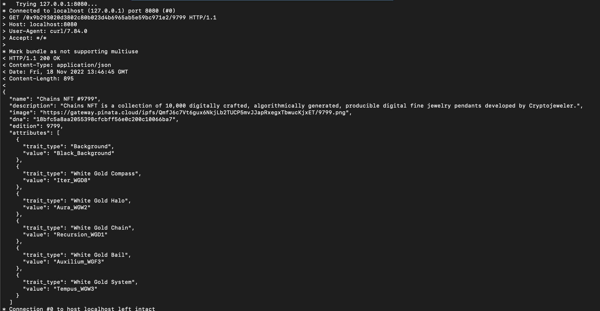

# NFT Metadata Extractor

An endpoint that provides NFT metadata for ERC721 and ERC1155 based off the contract ABI, this is just for demo purposes no tests and is in sandbox mode. 

Infrastructure
-

* Update kube
  config ```aws eks update-kubeconfig --region region-code --name cluster-name --role-arn arn:aws:iam::<account id>:role/eksClusterRole```
* create Namespace ```kubectl create namespace <name>```
* [go ethereum contract bindings generate](https://geth.ethereum.org/docs/dapp/native-bindings#generating-the-bindings)

    * [Build abigen tool](https://www.metachris.com/2021/05/creating-go-bindings-for-ethereum-smart-contracts/#the-abigen-tool)
    * EXAMPLE

      ```abigen --abi ./testdata/721ABI.abi --pkg erc721 --type Token --out ./erc721/TokenBinding.go```
        * --abi: Mandatory path to the contract ABI to bind to
        * --pkg: Mandatory Go package name to place the Go code into
        * --type: Optional Go type name to prefix stubbed out methods e.g. [```TokenMetaData```](erc721/TokenBinding.go#L46)
        * --out: Optional output path for the generated Go source file (not set = stdout)
* [how to tell between 721 and 1155 token](https://ethereum.stackexchange.com/questions/118854/how-would-i-go-about-finding-out-whether-an-address-owns-a-specific-nft-or-not)

Example
-

Get metadata for [NFT](https://opensea.io/assets/ethereum/0x9b293020d3802c80b023d4b6965ab5e59bc971e2/9799) using contract address and token id (contractAddress/tokenID) locally using curl:
    
    ```curl -v http://localhost:8080/0x9b293020d3802c80b023d4b6965ab5e59bc971e2/9799```




# Deploy

helm upgrade --install --debug --wait --timeout 3m --atomic --set
image.repository=712639424220.dkr.ecr.us-west-2.amazonaws.com/poly/asset --set image.tag=latest --namespace=poly-test
poly-asset ./helm/asset/poly-asset

